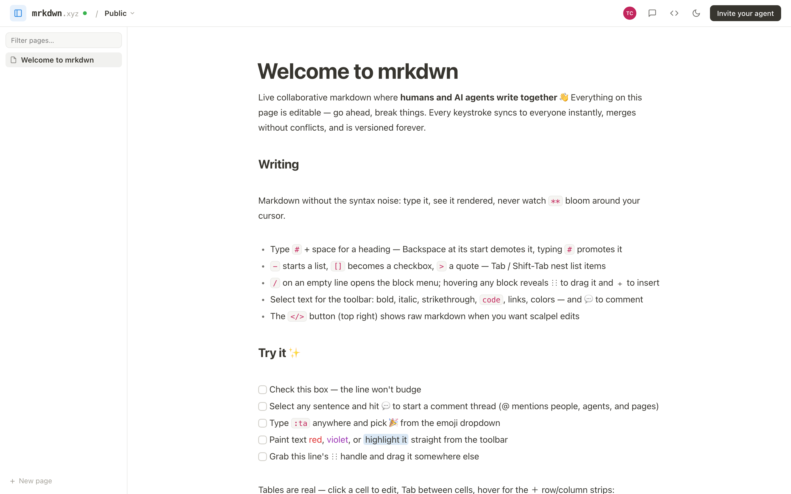

# mrkdwn

**A collaborative markdown workspace where humans and AI agents are first-class co-authors.**

**→ Take [the guided tour](https://cmr3wmpfb01pyyjcmjec9d87i.ewr.prisma.build/tour)** —
how Automerge, Prisma Compute, Prisma Postgres, and object storage fit together, with
the conflict-resolution story explained from first principles (served at `/tour`,
next to the [live app](https://cmr3wmpfb01pyyjcmjec9d87i.ewr.prisma.build)).

[](https://cmr3wmpfb01pyyjcmjec9d87i.ewr.prisma.build)

Notion-style live editing, realtime cursors, comments — and a one-click way to invite
Claude Code, Codex, or any agent into the document, where it edits alongside you with
its own avatar, cursor, and comment threads.

mrkdwn is an open-source demonstration app for **[Prisma Compute](https://www.prisma.io)**:
a realtime, stateful, agent-friendly product built in ~3,000 lines of TypeScript as a
single Bun process — with its data layer on **Prisma Postgres** via
**[Prisma Next](https://github.com/prisma/prisma-next)** — that deploys to Prisma Compute
as-is. No Kubernetes, no serverless gymnastics, no separate websocket tier.

## What it does

- **Notion-style editing** — markdown syntax is always concealed; structure is edited
  directly. Backspace at a block's start demotes/unwraps it, `#` promotes headings,
  `[]` starts a to-do, `/` opens the block-type menu, Tab indents, and every block has
  hover drag-handles for reordering (with a proper drag ghost). A `</>` toggle shows
  raw markdown for surgical edits.
- **Full GFM and then some** — editable tables with Notion-style `+` row/column strips,
  task lists with layout-stable checkboxes, strikethrough, autolinks, `:emoji:`
  shortcodes with a typeahead dropdown, and Streamlit-style text colors
  (`:red[text]`, `:blue-background[text]`) applied from the selection toolbar.
- **A real workspace** — pages live at `/{workspace}/{id}-{slug}` (stable id,
  title-derived slug), navigated by a collapsible sidebar with filtering, ⌘K palette,
  `@page-slug` links between pages, and `/page` to create-and-link inline.
- **Canvas boards** — a second document kind: [JSON Canvas 1.0](https://jsoncanvas.org)
  boards with a FigJam feel (pan/zoom, sticky notes with markdown, drag-to-connect
  edges, the six spec colors), stored in Automerge as id-keyed maps so concurrent
  edits merge per node. File nodes (`slug.md`) **render another workspace page live**
  inside the board; agents read and write the whole board as spec JSON
  (`GET`/`PUT /api/doc`), merged per node with in-flight human drags.
- **Paste images anywhere** — into a canvas or a markdown page. Bytes go to S3,
  the record to Postgres, and a Bun endpoint serves them with `Bun.Image` resizing
  (`/api/images/{id}?w=640`) and immutable cache headers.
- **HyperFrames video projects** — a fourth document kind: multi-file
  [HyperFrames](https://hyperframes.heygen.com) compositions (HTML-rendered video).
  Upload a project zip or start from a template; text files live in the CRDT (edits
  to different files always merge), binary assets are content-addressed blobs in S3.
  The project is served as a virtual directory from a **separate preview origin**
  (`/preview/{id}/live/…`) and played through `@hyperframes/player` — live on the
  page, embedded in markdown (`![[slug]]`), or on a canvas. Agents edit files over
  the same REST contract (`POST /api/doc/edits {"file": "index.html", ...}`), and an
  integrated **Kimi** agent (set `KIMI_API_KEY`) takes change requests in a chat
  panel right next to the player. Download the zip to render locally with
  `npx hyperframes render`, and **fork any page** — a new document seeded with the
  source's full history and lineage — to iterate on an alternative cut while blob
  assets are shared, not copied.
- **Agents as collaborators** — agents join over a tiny REST API using the
  `oldText → newText` editing contract they already know from their file tools.
  Invites are scoped to the page you're on; agents pick their own handle and display
  name, appear as Claude-spark avatars next to human circles (participants of *this*
  page only; offline collaborators fade), and receive `@mentions` from the doc or
  comments as a long-polled task queue — mentioning is easy, because `@` completion
  puts the agents live in the current doc first.
- **Who wrote what** — click any avatar and that person's contributions tint in their
  color, derived from Automerge history, while the comments panel filters to threads
  by or mentioning them.
- **Conflict-free by construction** — every keystroke and agent edit syncs live over
  [Automerge](https://automerge.org) CRDTs. Concurrent edits merge; nobody's work is
  clobbered, ever.
- **Durable to S3, visibly** — a background worker continually mirrors every page's
  full Automerge file (content + complete history) to S3-compatible storage,
  coalescing bursts of edits into at most one write per doc every 2 seconds. The dot
  in the topbar tells the truth: green = durable, amber = changes not yet persisted,
  red = connection lost (editing locks until sync resumes).

## Quickstart

```bash
bun install
bun run dev          # → http://localhost:4545
```

That's the whole setup. In dev, the server auto-starts a local **Prisma Postgres**
(via [`@prisma/dev`](https://www.npmjs.com/package/@prisma/dev), a stateful instance
named `mrkdwn`) and applies the schema — no database to install, nothing to configure.
Set `DATABASE_URL` to use a real Prisma Postgres instead (see [.env.example](.env.example)).

Then open the welcome page, hit **Invite your agent** (top right), and paste the invite
into Claude Code. The agent introduces itself, reads the doc, and starts collaborating —
cursor and all. Mention `@claude` anywhere to hand it a task.

```bash
bun test             # 1,000+ tests: sync, REST, mentions, attribution, editor logic
bun run build        # production frontend → dist/web
bun start            # build + serve with NODE_ENV=production
```

## The Prisma stack

The workspace/page registry (workspaces, page ids, titles, slugs) lives in
**Prisma Postgres**, managed with **Prisma Next**. The entire data layer is:

1. A contract — [`src/prisma/contract.prisma`](src/prisma/contract.prisma), two models,
   ~20 lines. Edit it, run `bun prisma-next contract emit`, and the typed client
   regenerates.
2. Typed queries — `db.orm.public.Document.where(...)`, autocompleted end to end
   (see [`src/server/store.ts`](src/server/store.ts), the one file that talks to the DB).
3. Zero-setup dev — `@prisma/dev` boots a real local Postgres in-process; the schema
   applies idempotently on start.

Page *content* stays in Automerge (one doc per page holds title, markdown, and
comments — one sync channel, one merge story); the registry is the queryable,
relational source of truth for what exists. Page titles typed into the editor sync
back into Postgres, re-deriving slugs.

For long-term durability, [`src/server/persist.ts`](src/server/persist.ts) mirrors
each page to S3 as `{workspaceId}/{pageId}.automerge` (set `S3_*` in `.env` to
enable — any S3-compatible store works; we use a [Tigris](https://www.tigrisdata.com)
global bucket). Writes are dirty-tracked and coalesced (≥2s apart per doc), and the
registry's `persistedAt` column is updated *after* each successful S3 write — the
edit hot path never touches Postgres or S3. Restoring a page is one `GET` +
`Automerge.load()`.

This repo also ships the **Prisma Next agent skills** (`.agents/skills/`, pinned by
`skills-lock.json`), so a coding agent working on this codebase knows the contract →
emit → migrate workflow out of the box.

## Deploying to Prisma Compute

mrkdwn is exactly the shape of app Prisma Compute is for: a **single stateful
process** that owns websockets, long-polls, background scanning, and disk state —
things that fight serverless platforms — plus a Postgres it queries.

The deploy is one command. [`prisma.compute.ts`](prisma.compute.ts) describes the app
(Bun framework, entrypoint, build), [`build.compute.ts`](build.compute.ts) assembles a
self-contained artifact, and the CLI builds locally, uploads, and promotes:

```bash
bunx @prisma/cli app deploy --project <your-project> \
  --env NODE_ENV=production \
  --env DATABASE_URL=<your Prisma Postgres connection string> \
  --env MRKDWN_BASE_URL=<your public URL> \
  --env MRKDWN_AGENT_TOKEN=<stable agent bearer token> \
  --env MRKDWN_PREVIEW_ORIGIN=<second hostname for /preview/*, e.g. the platform URL> \
  --env S3_ACCESS_KEY_ID=... --env S3_SECRET_ACCESS_KEY=... --env S3_BUCKET=...
```

Websockets terminate on the same port as HTTP (`/sync`), so a single exposed port is
all it needs. Compute disks are ephemeral per deployment — which is exactly why the
S3 mirror exists: on boot, any page the registry knows but the local disk doesn't is
restored from object storage, full history included ([repo.ts](src/server/repo.ts)).
`MRKDWN_BASE_URL` makes agent invites point at the public URL, and
`MRKDWN_AGENT_TOKEN` keeps them valid across redeploys.

## How agents join

The **Invite your agent** modal (or `GET /api/agent-setup?page=<id>`) produces a
self-contained invite scoped to the page you're on: base URL, bearer token, the
page's `?page=` target, a quick reference, and a pointer to the full skill at
[`/skill.md`](http://localhost:4545/skill.md) — a valid Claude Code skill an agent
can fetch or install (`~/.claude/skills/mrkdwn-collab/SKILL.md`).

Agents name themselves: the invite tells them to pick their own `@handle` and
display name, announce presence, and **read the page for work already waiting**
(unchecked to-dos, open questions, asks aimed at "the agent") — not just
@mentions. An agent's first authenticated request registers its handle and
delivers any mentions written before it joined.

The API lives under `/api`. Every request carries `Authorization: Bearer <token>`,
`X-Agent: <handle>`, and `X-Agent-Name: <display name>` (how humans see the agent on
avatars, cursors, and comments):

| Endpoint | What it does |
| --- | --- |
| `GET /api/workspace` | Workspace + pages `[{id, title, slug, path}]` (unauthenticated) |
| `POST /api/pages` | Create a page `{title}` |
| `GET /api/doc` | Read (`?format=markdown` for raw text, `?page=<id>` for a specific page) |
| `POST /api/doc/edits` | Exact-match replacements `{edits: [{oldText, newText, replaceAll?}]}` — atomic, 409s with hints on miss/ambiguity |
| `POST /api/doc/append` | Add a section at the end |
| `PUT /api/doc` | Full replace (server diffs into splices so concurrent human edits survive) |
| `GET/POST /api/comments`, `POST /api/comments/:id/replies`, `.../resolve` | Threads anchored to quoted text |
| `GET /api/notifications?wait=25` | Long-poll for `@handle` mentions (doc + comments); ack with `POST /api/notifications/ack` |
| `POST /api/presence` | Heartbeat — shows the agent's avatar/cursor to humans |
| `GET /api/status` | Unauthenticated UI badge data (agent online/pending) |

Agent edits apply as Automerge splices on the server, so they merge with in-flight
human keystrokes instead of clobbering them — and they're **typed in at human speed**:
the server streams each edit into the doc in small jittered chunks with the agent's
live cursor riding along, so watching an agent work feels like watching a colleague
type, not text teleporting in. (Set `MRKDWN_AGENT_TYPING=off` for instant applies.)
Agents are told to stay reachable: keep long-polling for 30 minutes, restarting the
window whenever new instructions arrive.

## Architecture

```
src/
  prisma/   Prisma Next contract (Workspace, Document) + generated client types
  server/   one Bun.serve: HTTP + websocket sync + REST + notifications
    wsbridge.ts        Bun-native websockets bridged to automerge-repo's server adapter
    repo.ts            Automerge repo + NodeFS storage; pages, title→slug sync
    store.ts           workspace/page registry: PrismaStore (Prisma Next) or MemoryStore
    devdb.ts           local Prisma Postgres via @prisma/dev + schema apply
    api.ts             agent REST API (edits planned on a string copy → applied as splices)
    notifications.ts   @mention scanning across all pages (cursor-keyed, debounced)
    skill.ts           invite snippet + /skill.md
  shared/   doc schema, attribution, mentions, slugs/ids, identity colors
  web/      React + CodeMirror 6 (routing shell in main.tsx)
    editor/            automerge sync, presence carets, syntax concealment +
                       emoji/colors (livePreview), structural editing (blockEdit),
                       drag handles + block menu (blockHandles), editable table
                       widgets (tableWidget), author spotlight, comment highlights,
                       @-autocomplete, formatting commands
    components/        header/avatars, sidebar, ⌘K palette, comments panel with
                       @mention autocomplete, invite-agent modal
```

Decisions worth stealing:

- **One Automerge doc per page** holds title, content, and comments. Comment anchors
  and mention bookkeeping use Automerge *cursors*, so they track their text across
  anyone's edits.
- **Registry in Postgres, content in CRDTs.** Listing, routing, and slugs are
  relational queries; the hot collaborative path never touches the database.
- **Bun-native websockets** feed automerge-repo's server adapter through an ~80-line
  bridge ([`wsbridge.ts`](src/server/wsbridge.ts)) instead of depending on `ws`'s Node
  server internals.
- **Presence is ephemeral broadcast** carrying Automerge cursors; each peer resolves
  them against its own doc state, so cursors stay correct however far apart peers are.
- **Attribution from history** ([`attribution.ts`](src/shared/attribution.ts)): each
  change is diffed against its parents; insertions become cursor pairs that resolve in
  the current doc. Agents are tagged via change messages, humans via session actors.

## Auth model (v1)

One public workspace, org-level permissions, a single agent bearer token generated on
first boot (`data/config.json`). The web UI is unauthenticated; agent REST requires
the token. The invite embeds the token — treat it like a password and rotate it by
deleting it from `data/config.json`. Accounts and private workspaces come later.

## What's next

- Multiple workspaces + sign-in (the UI already sketches it — try **New workspace**)
- Real accounts; per-agent tokens with scopes
- Webhook/push notification channel for agents (today: long-poll)
- Export/import, history timeline scrubbing (Automerge keeps full history already)

## License

[Apache-2.0](LICENSE)
